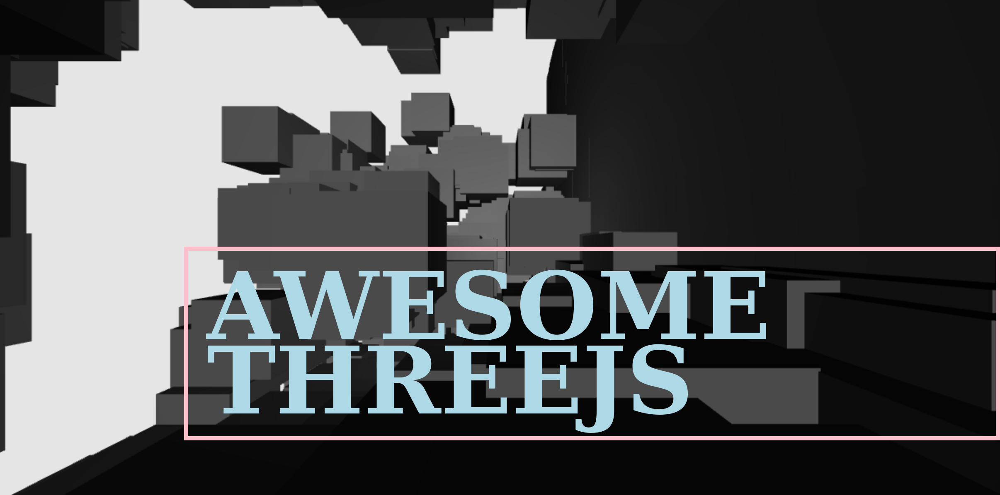

# learn-three-js  
Three JS shape rendering obtained by small changes to Three JS crash course:

https://www.youtube.com/watch?v=6oFvqLfRnsU

## Live Session Debugging

Open terminal on working directory

Type: live-session 

(requires installation of npm live-session)